基于SpringBoot的大学生平时成绩量化管理系统（程序+论文）
=
- 完整代码获取地址：从戎源码网 ([https://armycodes.com/](https://armycodes.com/))
- 作者微信：19941326836  QQ：952045282 
- 承接计算机毕业设计、Java毕业设计、Python毕业设计、深度学习、机器学习
- 选题+开题报告+任务书+程序定制+安装调试+论文+答辩ppt 一条龙服务
- 所有选题地址https://github.com/nature924/allProject

一、项目介绍
---
基于Spring Boot框架实现的大学生平时成绩量化管理系统，系统包含三种角色：管理员、教师、用户,系统分为前台和后台两大模块，主要功能如下。

### 前台功能：
- 首页：展示系统的概况、热门课程、公告信息等内容。
- 论坛：提供用户间的交流和讨论平台。
- 课程资源：提供学生查看和下载课程相关的资源文件。
- 公告信息：展示与学生平时成绩量化管理相关的公告信息。
- 个人中心：学生个人信息管理、成绩查询等功能。

### 后台功能：
### 教师：
- 个人中心：管理个人信息和账户。
- 学生管理：对学生信息进行管理，包括新增、编辑、删除等操作。
- 课程资源管理：上传、编辑和删除课程相关的资源文件。
- 教案信息管理：发布和管理教案信息，包括新增、编辑、删除等操作。
- 学生成绩管理：录入和管理学生成绩，支持成绩的查询和统计功能。
- 论坛管理：管理论坛的帖子和评论。
- 公告信息管理：发布和管理公告信息。
  
### 管理员：
- 个人中心：管理个人信息和账户。
- 管理员管理：对系统中的管理员账号进行管理和权限设置。
- 教师管理：管理系统中的教师信息，包括新增、编辑、删除等操作。
- 学生管理：管理系统中的学生信息，包括新增、编辑、删除等操作。
- 课程资源管理：管理系统中的课程资源文件，包括上传、编辑和删除等操作。
- 教案信息管理：发布和管理系统中的教案信息。
- 学生成绩管理：对学生成绩进行管理，包括录入、编辑和删除等操作。
- 基础数据管理：管理系统的基础数据，如学院、专业等信息。
- 论坛管理：管理论坛的帖子和评论。
- 公告信息管理：发布和管理系统中的公告信息。
- 轮播图信息：管理系统首页轮播图的内容和链接。

二、项目技术
---
- 编程语言：Java
- 数据库：MySQL
- 项目管理工具：Maven
- 前端技术：VUE、HTML、Jquery、Bootstrap
- 后端技术：Spring、SpringMVC、MyBatis

三、运行环境
---
- 操作系统：Windows、macOS都可以
- JDK版本：JDK1.8以上都可以
- 开发工具：IDEA、Ecplise、Myecplise都可以
- 数据库: MySQL5.7以上都可以
- Tomcat：任意版本都可以
- Maven：任意版本都可以

四、运行截图
---
### 论文截图：
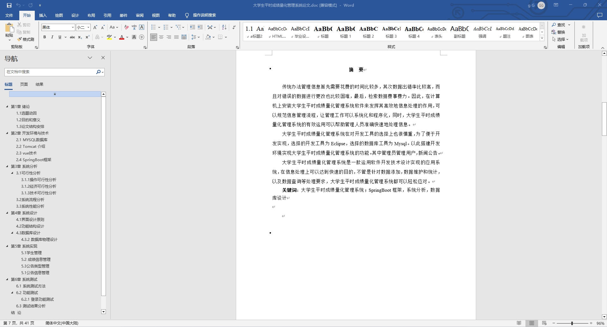
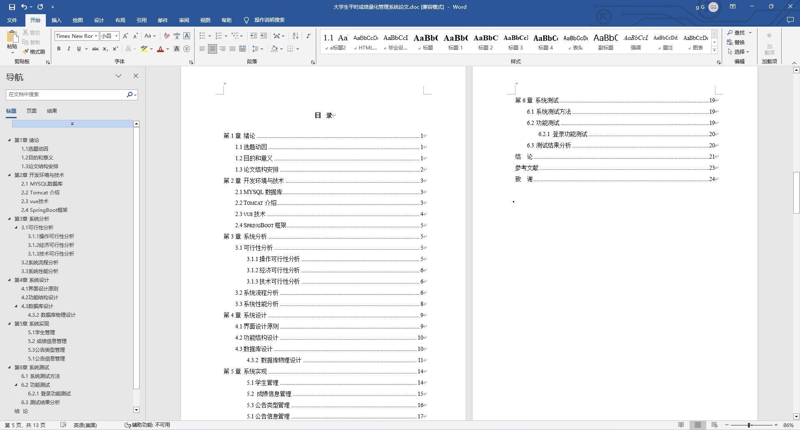

### 程序截图：
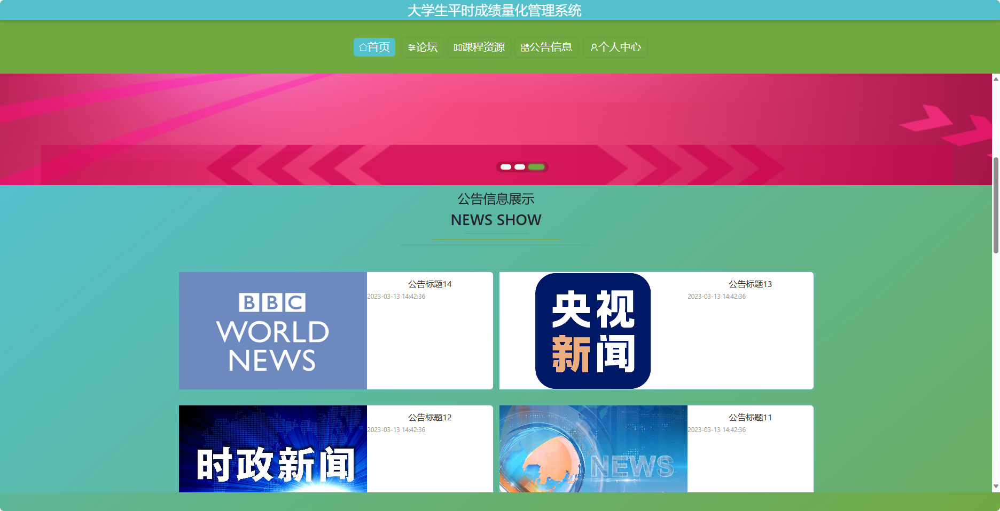
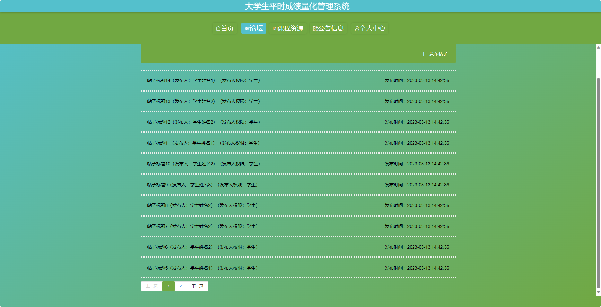
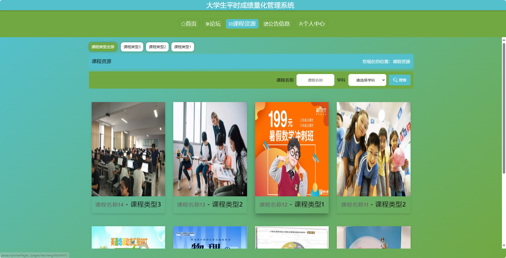
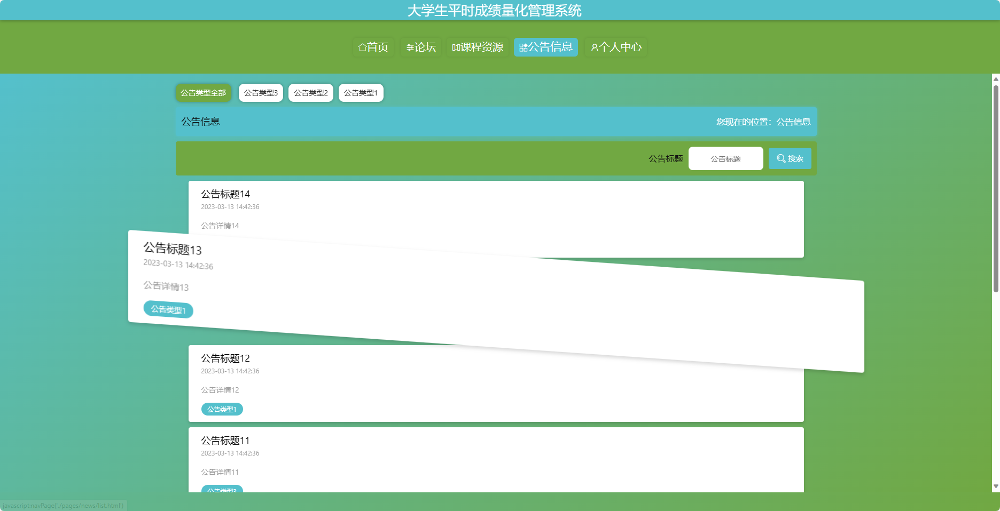
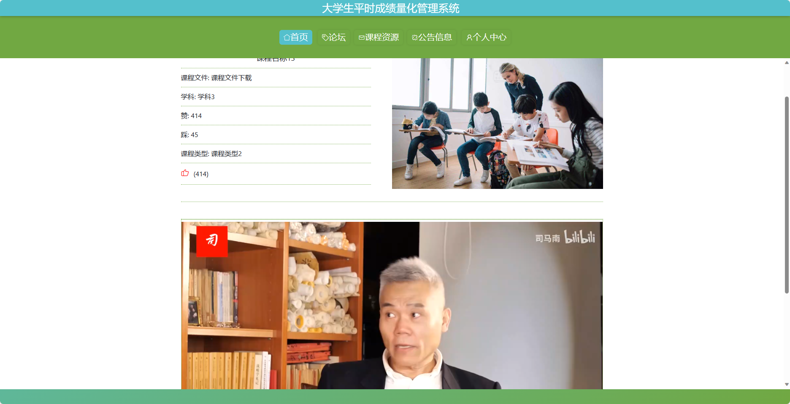
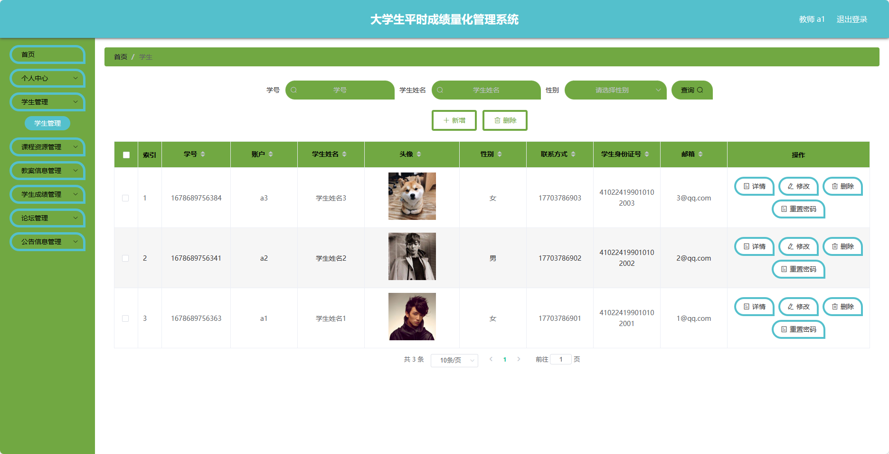
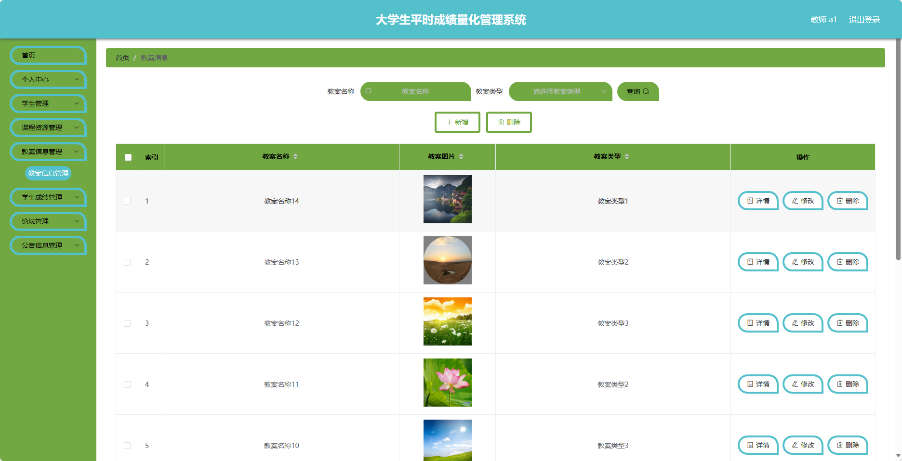
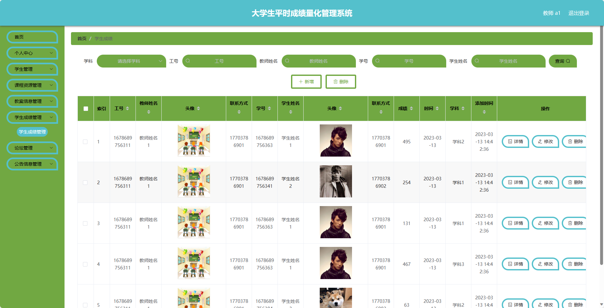
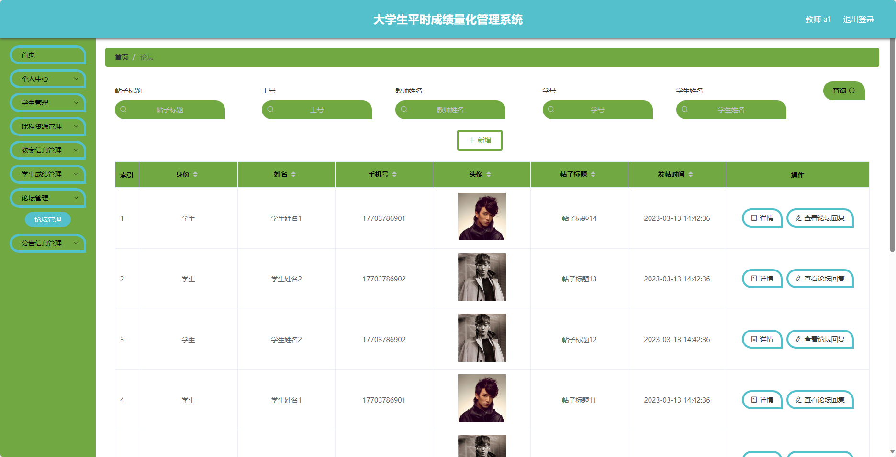
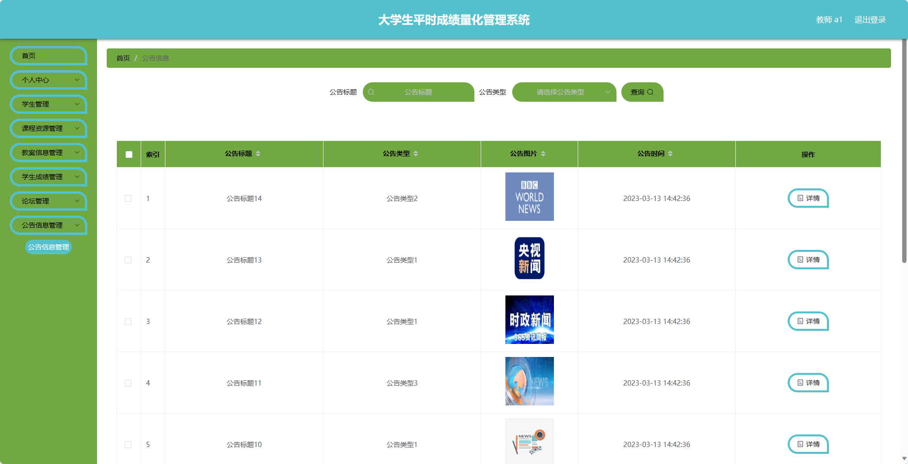

